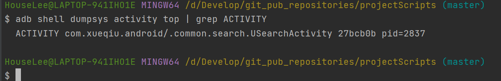
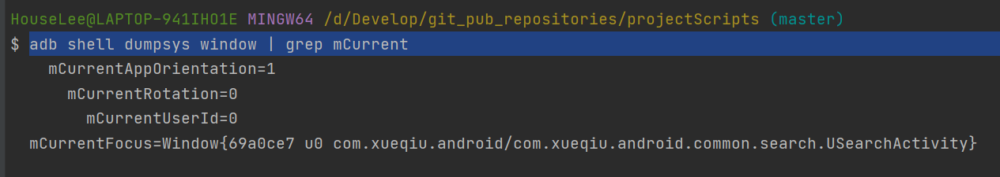

- adb logcat | grep -i displayed

- adb shell dumpsys activity top
    
  
- adb shell dumpsys window | grep mCurrent
    

adb shell am start -W -n com.xueqiu.android/com.xueqiu.android.common.search.USearchActivity -S