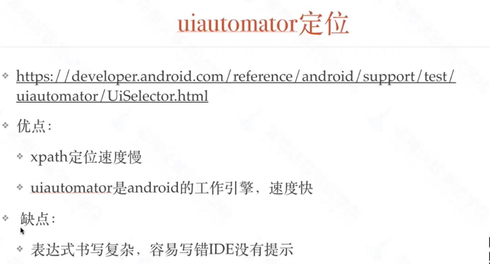
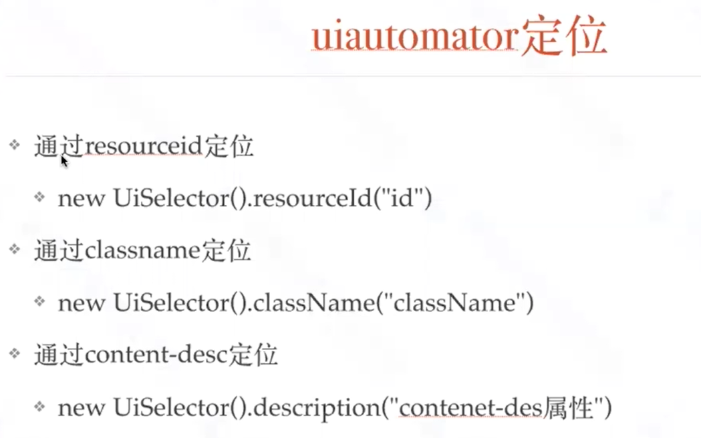
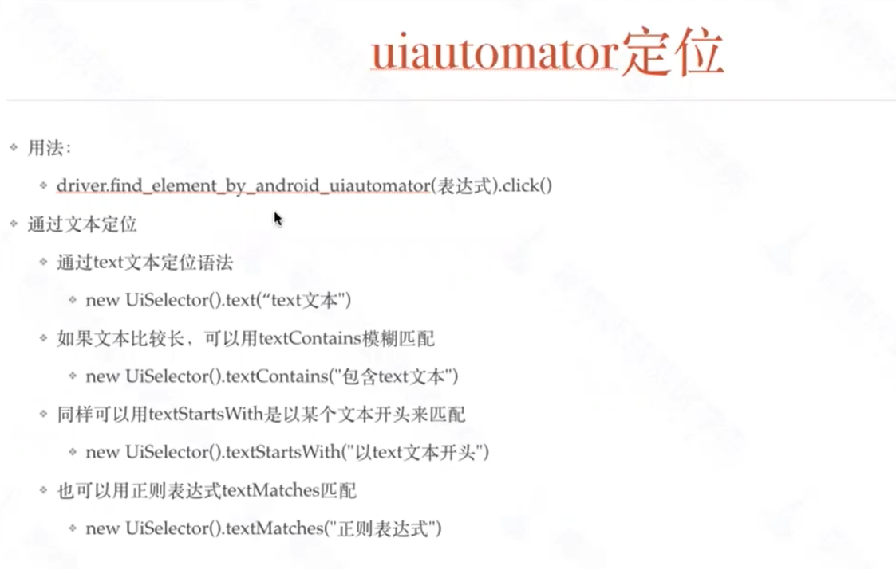
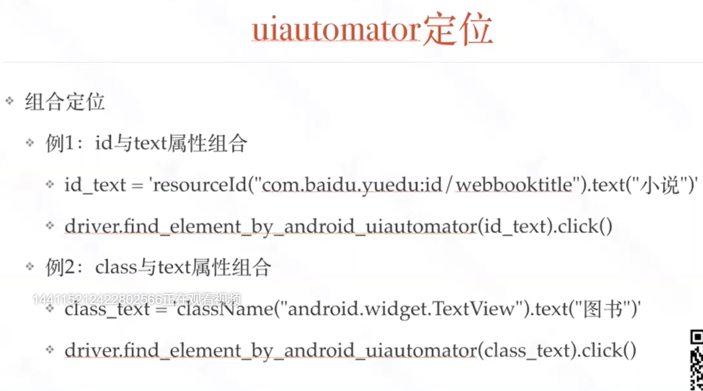
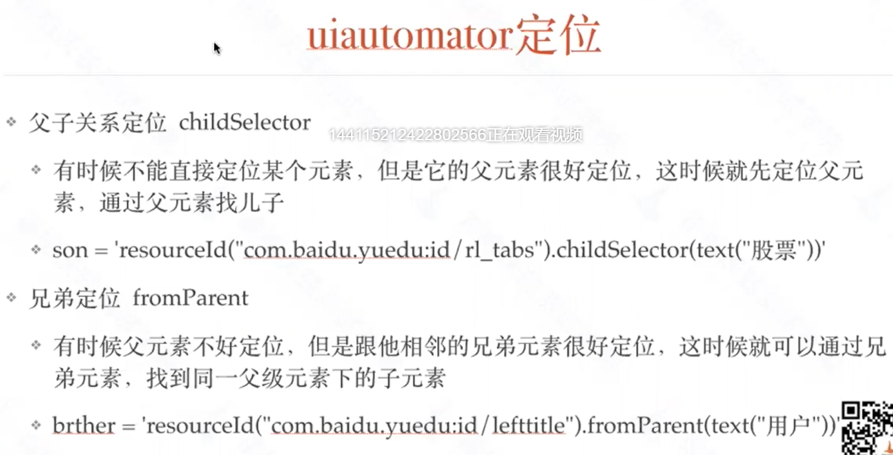
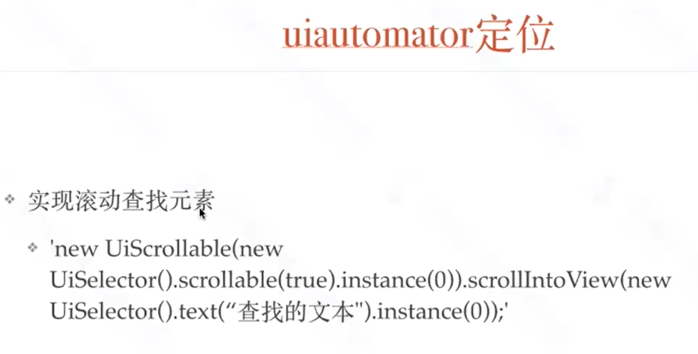

- ## uiautomator定位方法
    - https://www.cnblogs.com/qican/p/11544421.html

- ## 滚动查找元素
    ```‘new UiScrollable(new

UiSelector().scrollable(true).instance(0)).scrollIntoView(new

UiSelector().text("查找的元素文本").instance(0));```
    
    