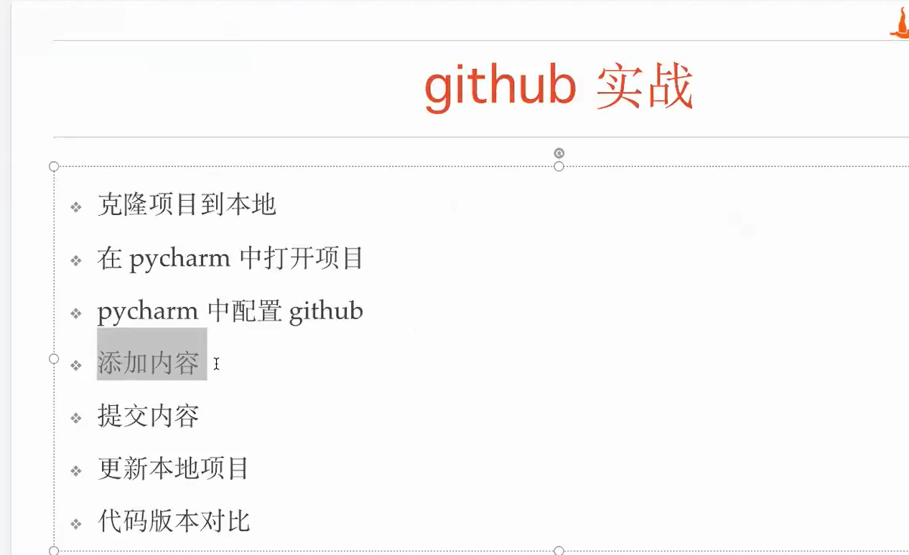

- 1、远程仓库克隆到本地
  - 复制ssh地址
    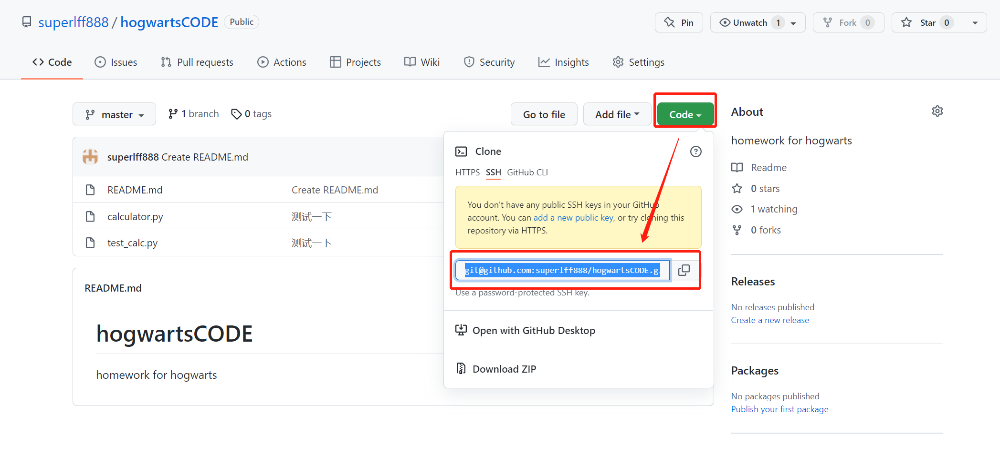
  - Terminal（git bash）命令行执行命令
    - 创建一个文件夹myRepositories（自定义目录），cd 到该目录下(D:\Develop\myRepositories)
      ```git clone git@github.com:superlff888/hogwartsCODE.git```
- 2、在pycharm中打开克隆到本地的项目（D:\Develop\myLocalRepositories\hogwartsCODE）    
    ``File --> Open --> D:\Develop\myLocalRepositories\hogwartsCODE ,点击“ok”``
    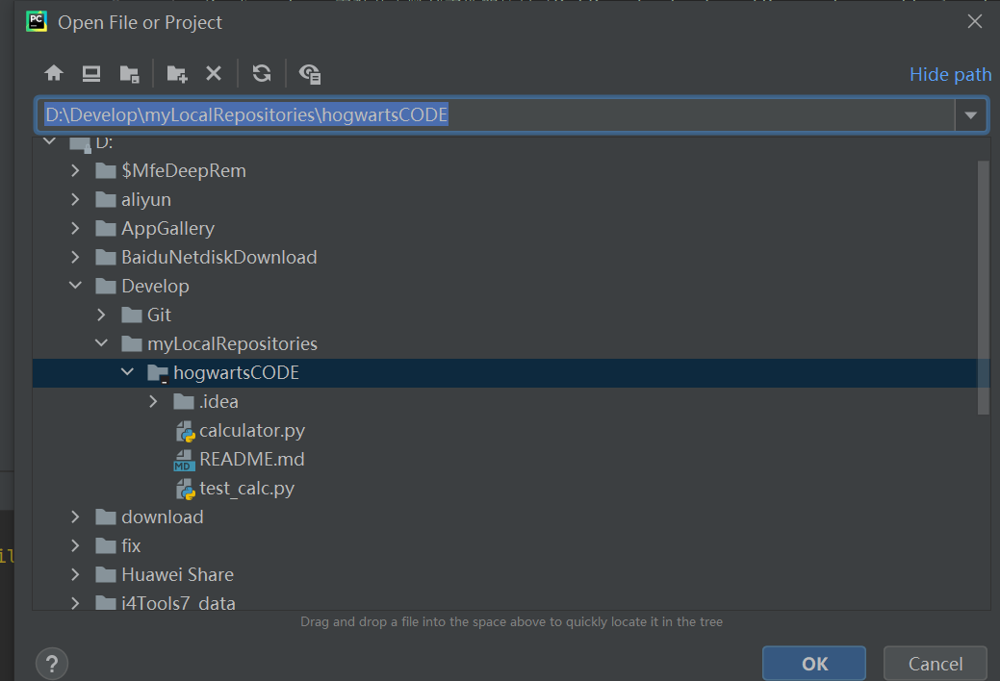
  
- 3、配置git工具和github
  - 配置git
  
    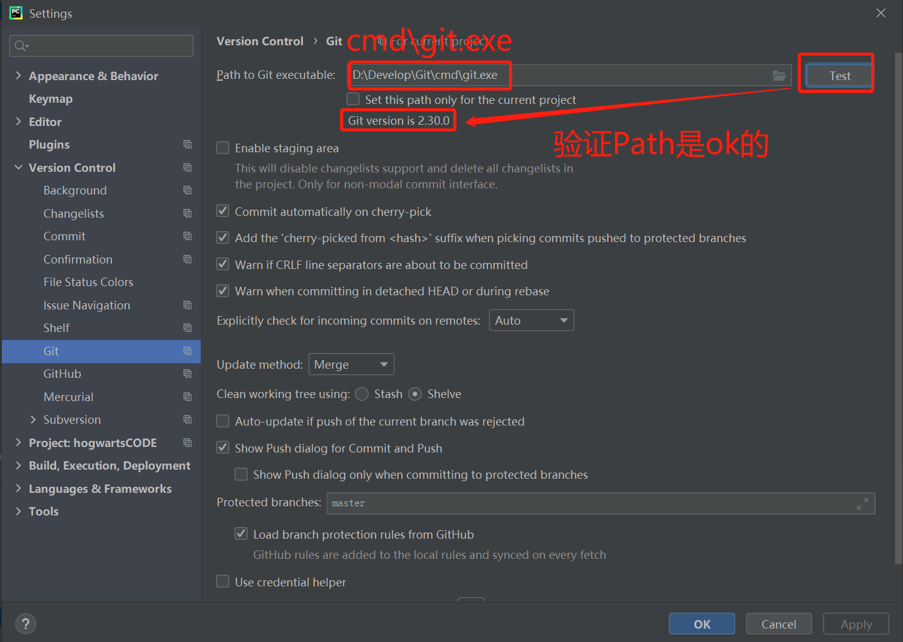
  - 配置hithub(Token方式)
    - 通过Token方式添加github账户
  
      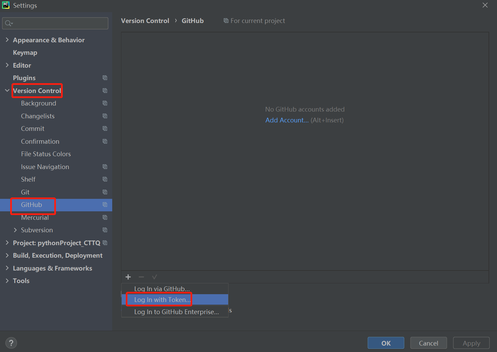
    - 获取Token（token设置的有效期为60天，所以60天后，要重新获得一个token）
      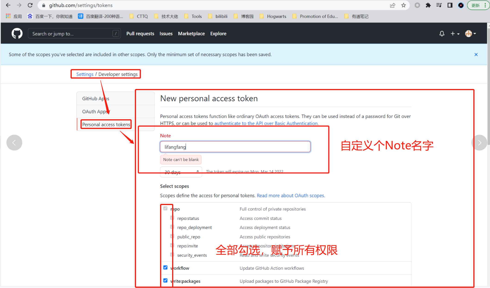
      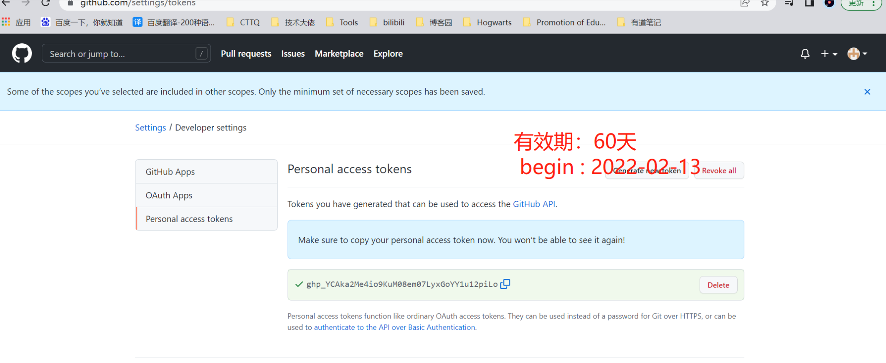
    - 输入获取的Token，点击“Add Account”
      
      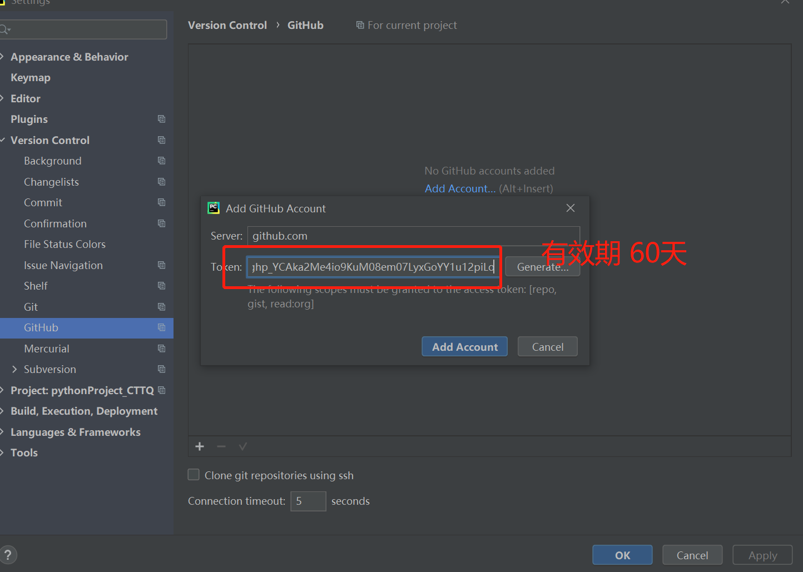 
   
    - 选中添加的github账号，点击“”，配置成功
      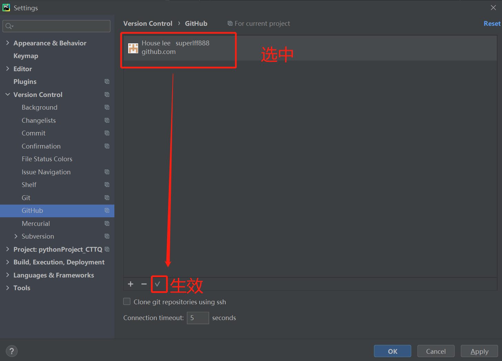
- 4、提交代码
  - 提交到本地仓库 git commit
    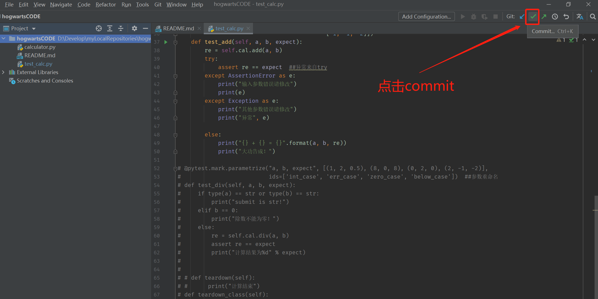
  - push到远程仓库
    - 点commit->push 或 直接点击commit and push
  
- 5、远程仓库有更新，同步到本地
  - 点击菜单栏git，点击pull或直接点击下图标记的箭头：
    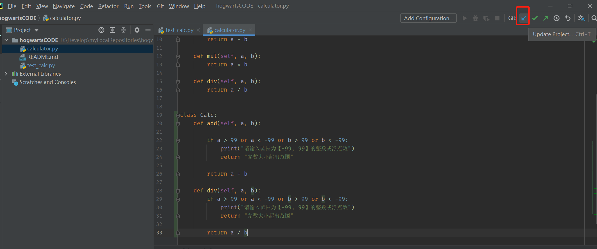
  
- 6、代码版本对比
  
    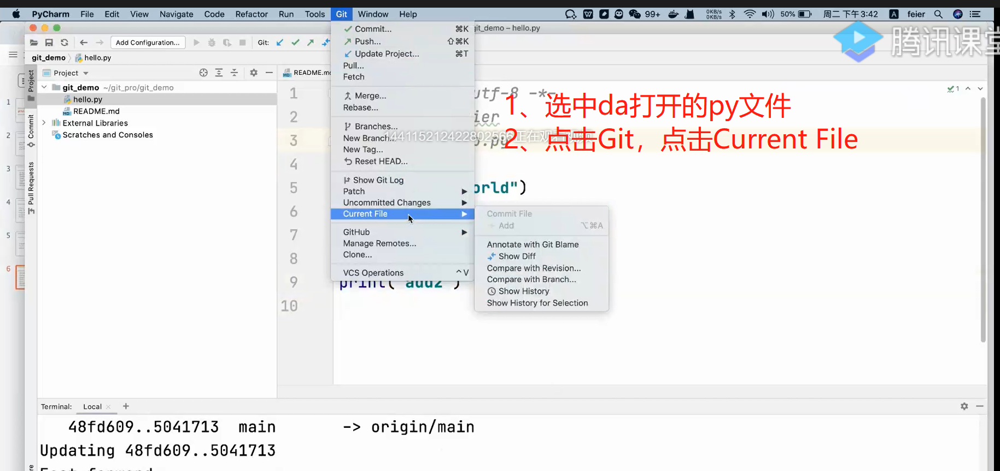
   
    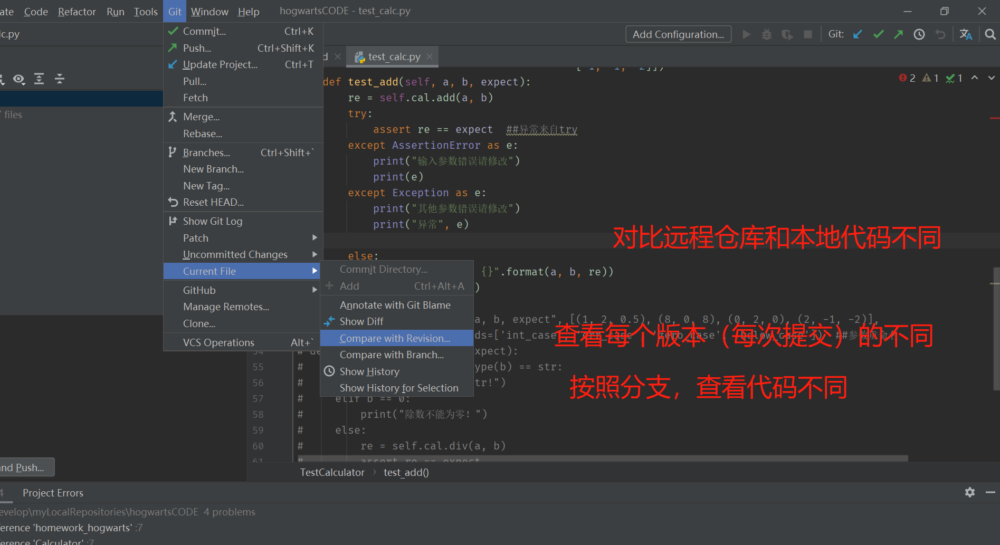
    
    - 代码回滚及show diff
    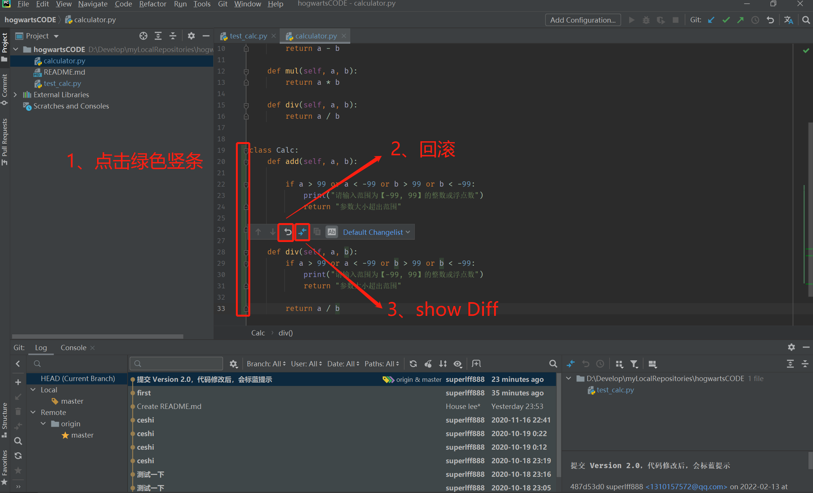
      
    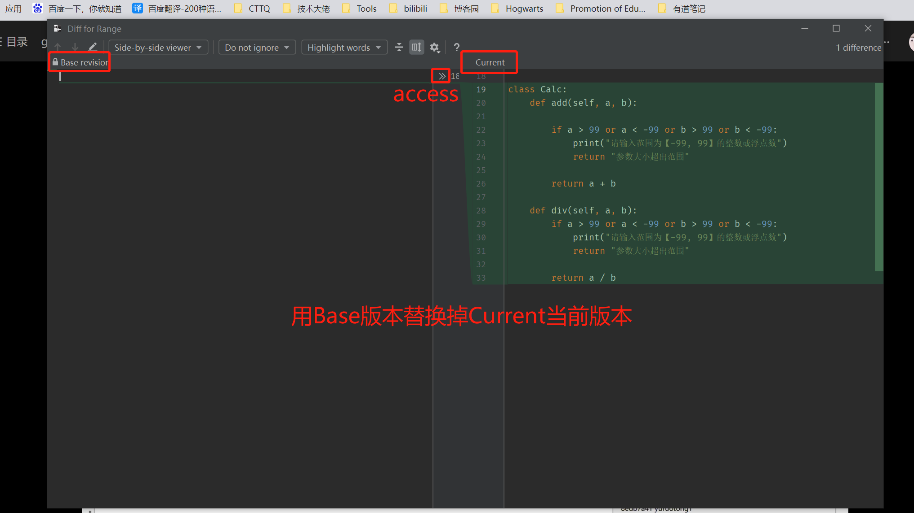
- 7、撤销commit修改（如果已经push到远程仓库，Current Branch 也可以回到目标版本，只不过此方法不能修改远程仓库）
    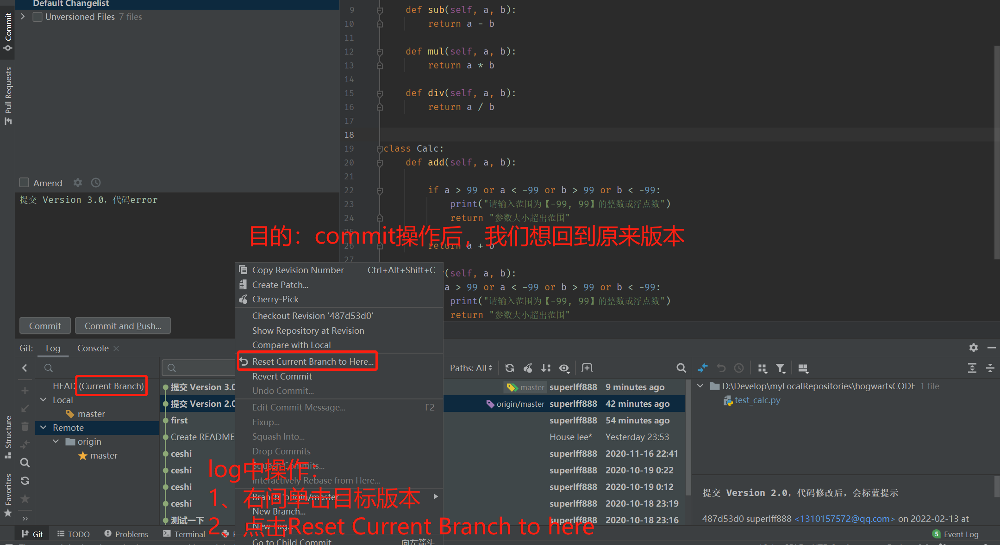
  - 删除远程仓库py文件方法
    - 打开目标文件，点击文件内容右上角的删除按钮
      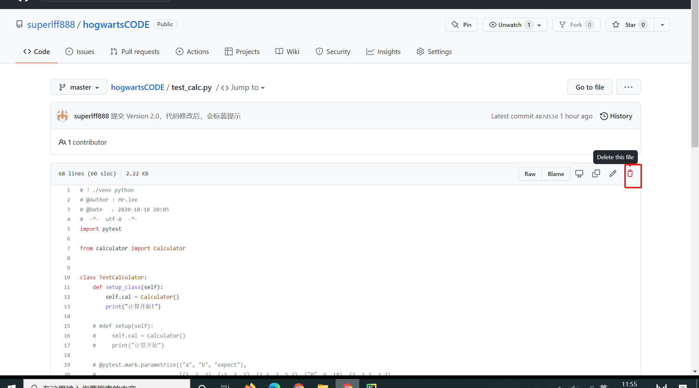
      
    - 点击“commit changes”进行确认
      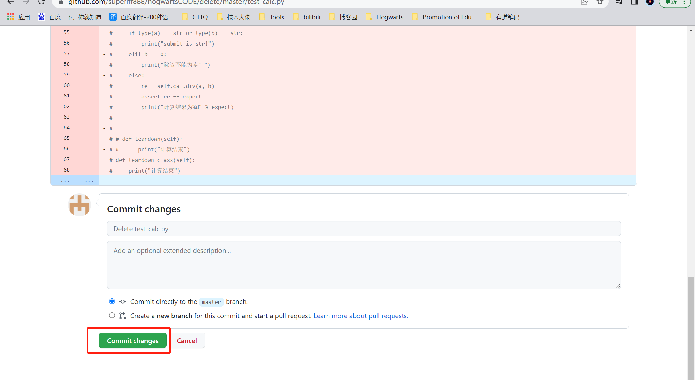