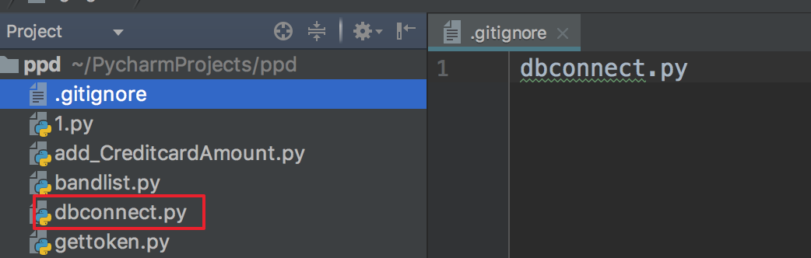

##**痛点： 项目中，有些配置项，或者比较隐私的东东，不想上传**

1、解决：在项目根路径下，创建.gitignore 文件

　　    文件中可以写文件名、文件路径等

2、结果： 提交到git，发现果真没有dbconnect.py这个文件了（里面是工作测试环境DB的user/pwd）

 

3、延伸：笔记本上提交了之后，在台式机上，克隆，发现确实没dbconnect.py，但是同步了.gitignore文件

4、那么，如何同步dbconnect.py呢？

 - 只好单独维护了，2个QQ互传，2个微信互传吧！
    