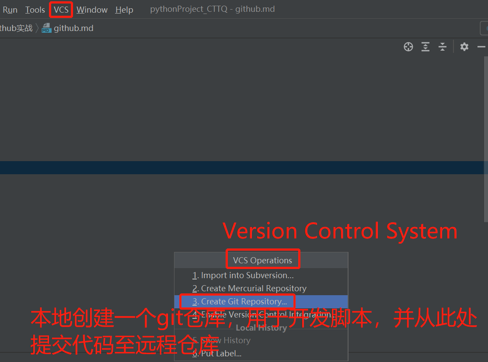
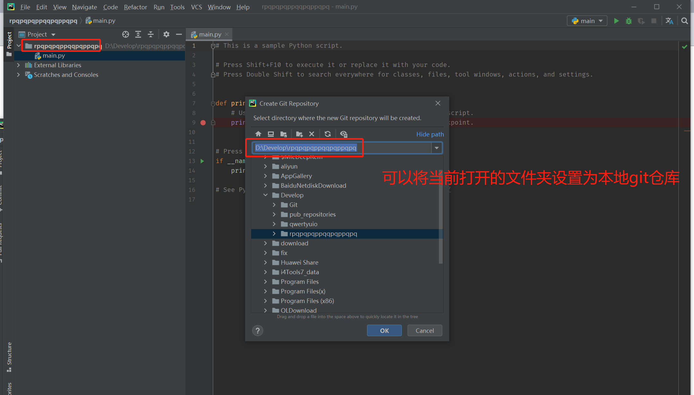
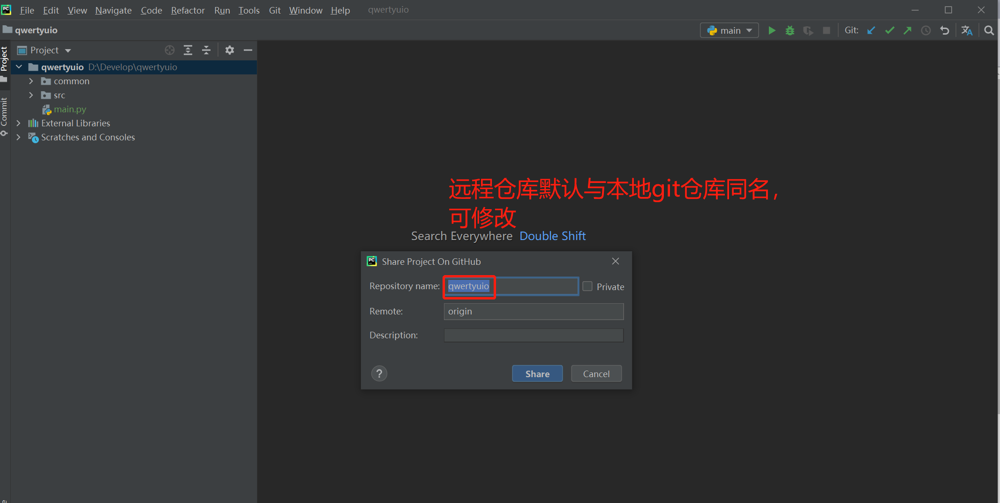
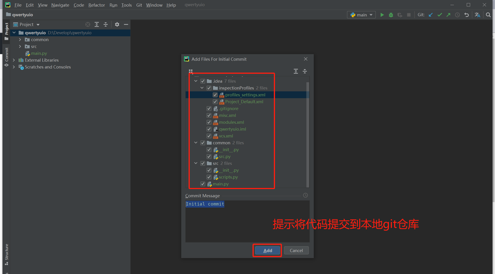
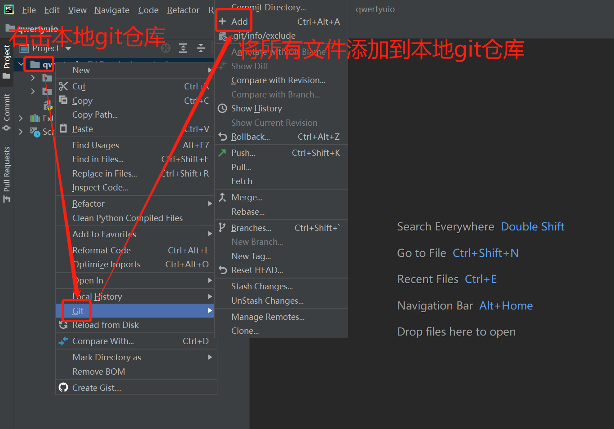
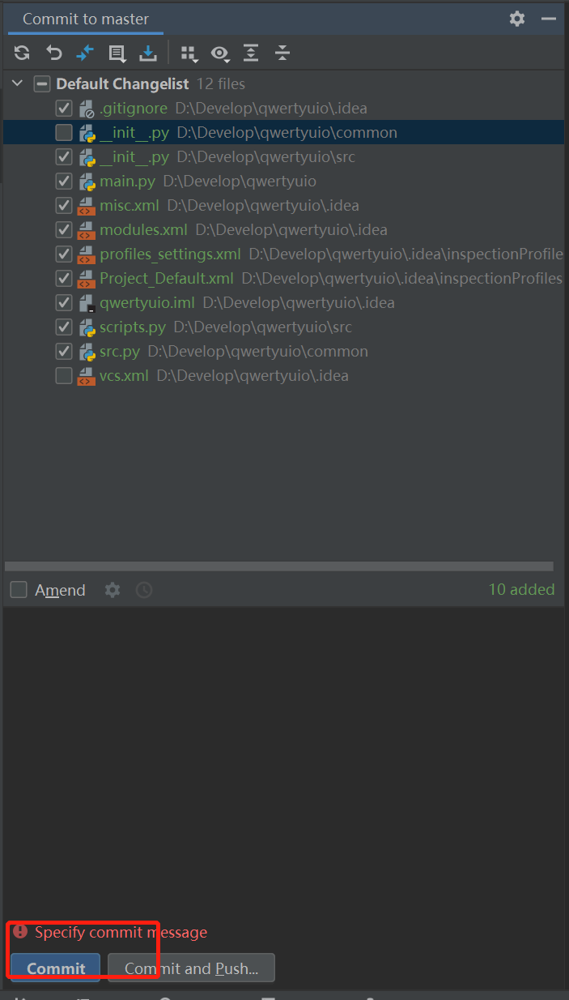
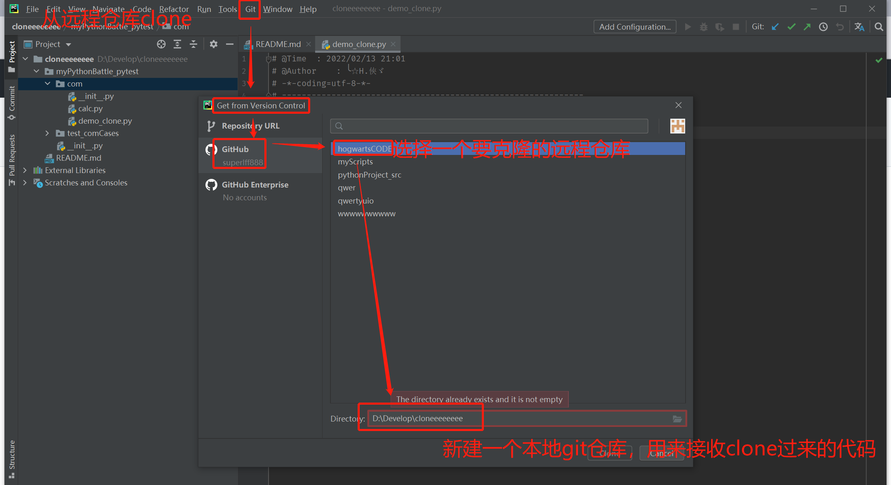
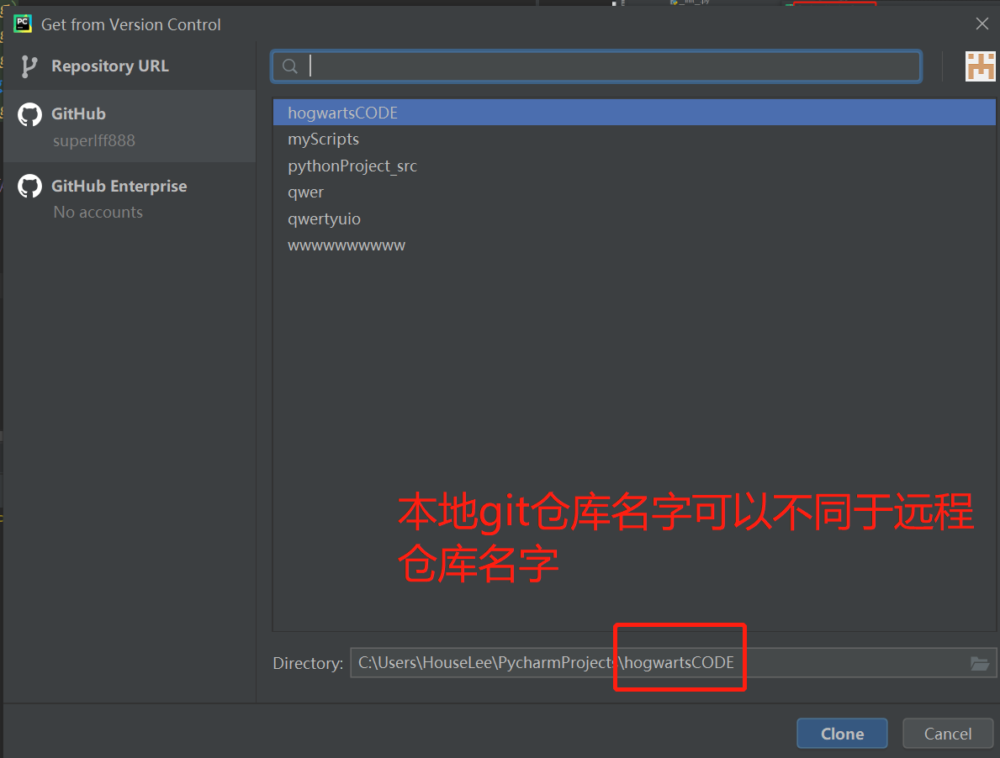
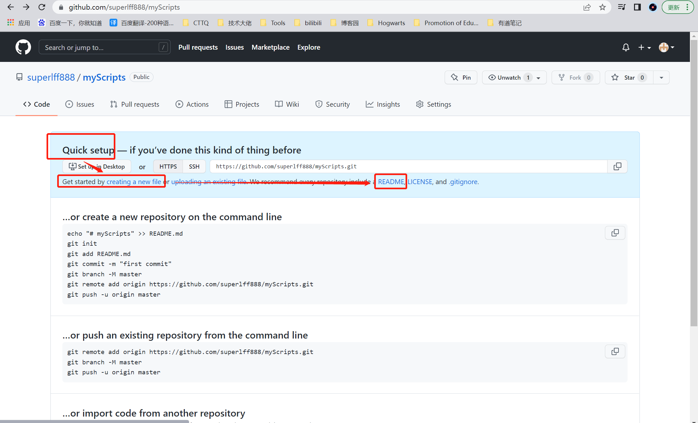

##1、前提
- pycharm中已经配置好git工具和github账户
- 理解三个位置：
  
    - 1、HEAD(Current Branch) 本地源代码  （git add到临时仓库）
    - 2、Local master Branch git仓库（D:\Develop\Git\cmd\git.exe） （git commit到git本地仓库）
    - 3、Remote Origin/master Branch  远程github仓库 （git push到远程仓库）
    
    
#2、本地git仓库连接远程github仓库的方式

- ##第一种方式：本地创建一个git仓库，可以共share项目到github（同时需要新建一个github仓库）
  - (1) 点击“VCS”；（点击“VCS Operations”，可省略此步）点击“Create Git Repository”
  
    
  - (2) 设置git仓库目录（可默认当前打开的目录） ，点击“ok” 
    
    - 此时菜单栏中的VCS变成了版本控制工具Git
  - (3) 根据需求输出项目脚本代码
  - (4) 点击菜单中的“Git”，然后下拉菜单中的“GitHub”中的“Share Project on GitHub”,新建一个github仓库，点击“share”（会提示：add至临时仓库，
  - 当然也可稍后手动add，见下图3【图中add位置标注错误，应该是add添加到临时仓库】
        
        
        
  - (5) 点击右上角的“”，输入commit message，点击commit，提交到本地仓库
        

    
- ##第二种方式：从远程github仓库克隆过来
  
  
  ###前提：要借助一个已建的git仓库，这样才能通过Git菜单打通本地仓库与远程仓库
   - 注意：本地Git仓库名可以另外命名 
    
- ## 新建仓库注意点：如图：
    
    
    