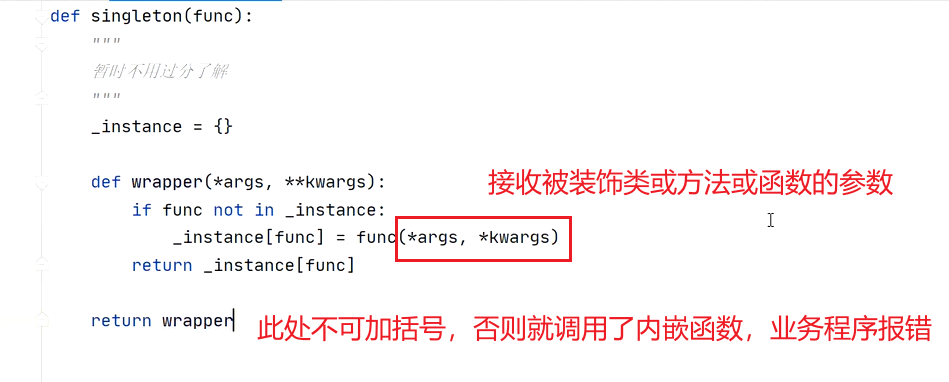
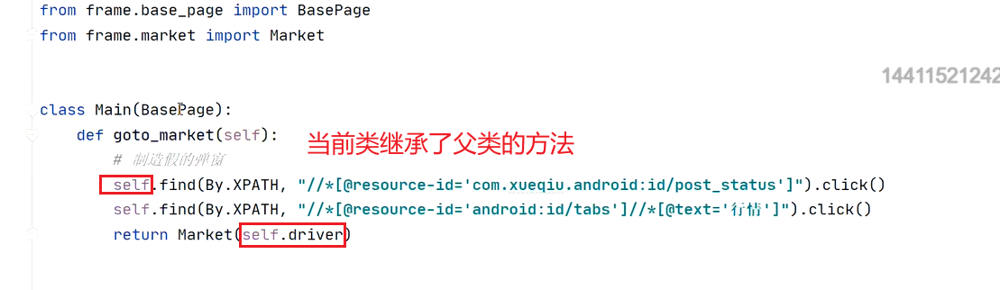
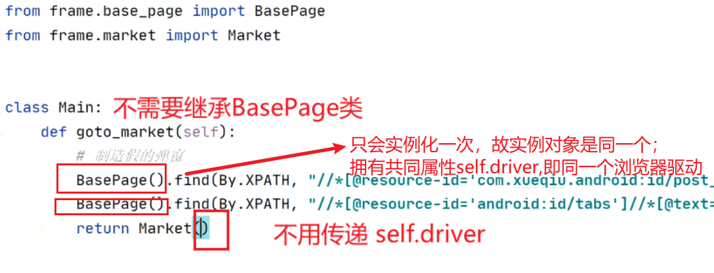

## 1、单例装饰器

- 

## 2、单例类
- 

## 3、采用组合方式调用单例类，去除继承，不需要传递self.driver
- 
- 

## 常规与代理模式的区别
- 常规方式 传递self.driver理解
  - 继承父类方法和属性
  - 
- 代理模式  将基类装饰成单例类，仅在初次调用单例类后，将实例对象保存到内存
  - 单例类只有一个实例，无论调用多少次单例类
    - 