# xpath
- 常用表达式符号
    - /a 代表的是 选取所有子元素a(仅指下一级元素)。```注意：/ 代表从根节点选取```
    - //a 代表所有元素，即子元素 + 子孙元素
        - 从匹配选择的当前节点选择文档中的节点，从不考虑位置
        - b//a 选取b元素下的所有a元素，即子元素及子孙元素
    - nodename 选取此节点的所有子节点
    - .  选取当前节点
    - .. 选取当前节点的父节点
    - @ 选取属性
    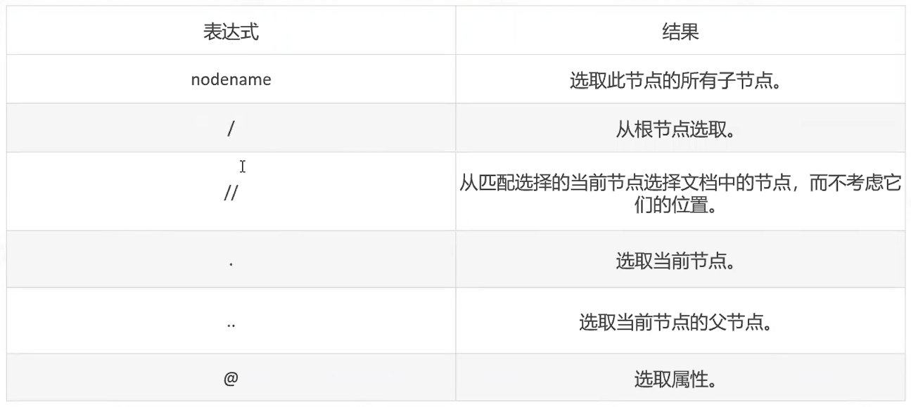
- ##xpath定位法：
  - 实例  
    ```
    <?xml version="1.0" encoding="UTF-8"?>
    <bookstore>
     
    <book>
      <title lang="eng">Harry Potter</title>
      <price>29.99</price>
    </book>
     
    <book>
      <title lang="eng">Learning XML</title>
      <price>39.95</price>
    </book>
     
    </bookstore> 
    ```
    
  
- 解析xml
    - /bookstore/book[1] ```选取bookstore子元素中第一个book元素```
      - / 代码最前面的元素，子元素
    - /bookstore/book[last()] ```选取bookstore子元素中最后一个book元素```
    - /bookstore/book[last()-1] ```选取bookstore子元素中倒数第二个book元素```
    - 相对路径定位  //标签名[@属性=“属性值”]
        - //div[@id='in1'] ```选取所有id属性值为'in1'的div元素'```
        - //*[@id='in1'] ```选取所有id属性值为'in1'的元素'```
    - /bookstore/book[price>35] ```选取bookstore所有book子元素，且其中的price元素的值必须大于35```
    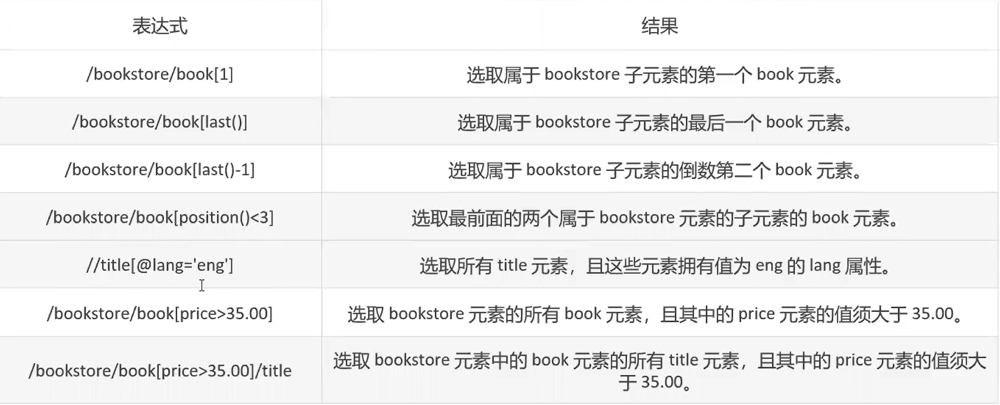
      
    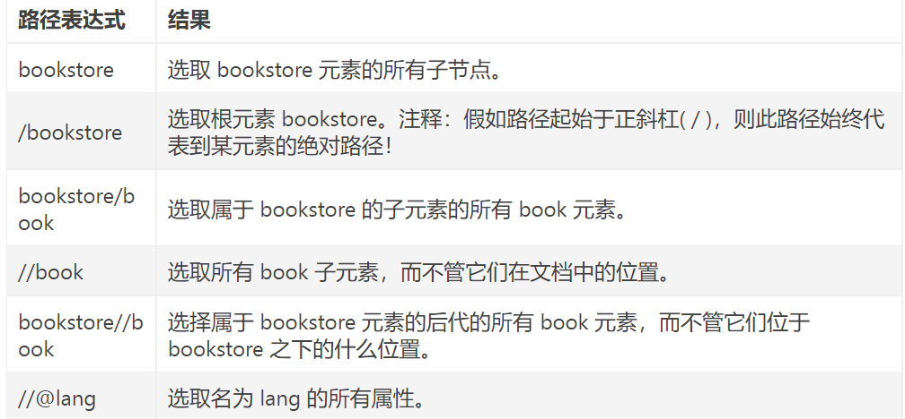
      
- 浏览器console检查元素唯一性
  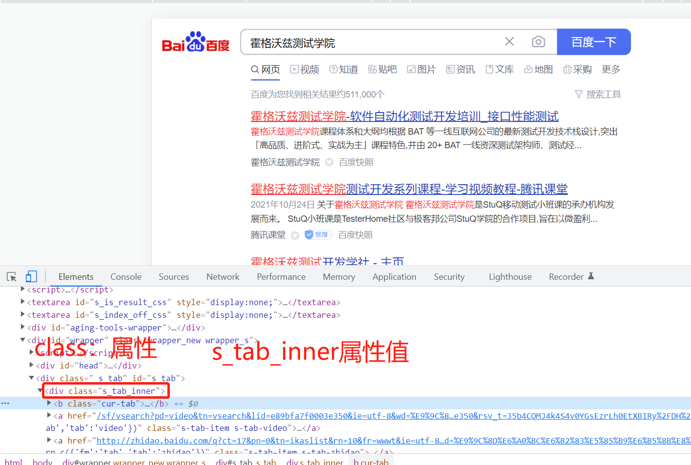
    - 1、clear() 清空console控制台
    - 2、$x("Xpath表达式") ```$x 代表用xpath进行定位```
    
        - id 和 name 一般都是唯一的（约定俗成）,所以可以采用//*[@id='value']定位
            - //*[@id="kw"]
            - //*[@name="wd"]
#css selector

- 表达式
    - .intro ```选择class='intro'的所有元素```
    
    - *#firstname* ```选择id='firstname'的所有元素```
    - * ```选择所有元素```
    - div,p ```选择所有<div>标签元素和所有<p>标签元素```
    - div p ```选择<div>元素内部的所有<p>元素```
    - div>p ```选择<div>元素内部的<p>子元素```
    - div+p ```选择紧跟在<div>元素后面的所有<p>兄弟元素``` 
    


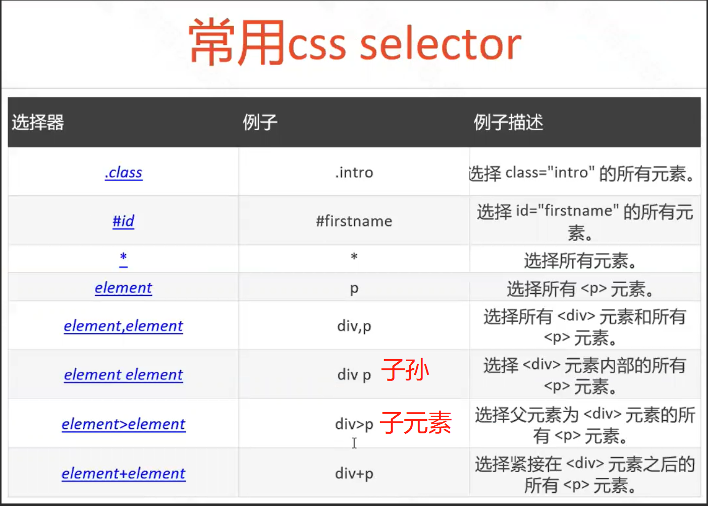      
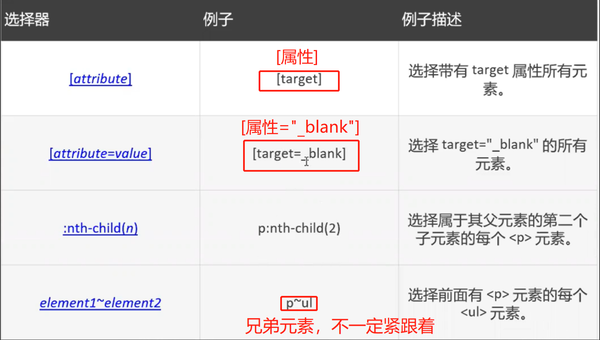

#实例
- ###子孙：代表子子孙孙，无穷无尽，所有下级标签，下下级标签……
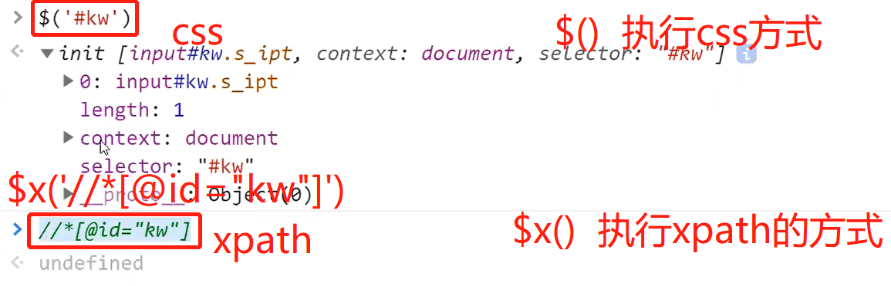
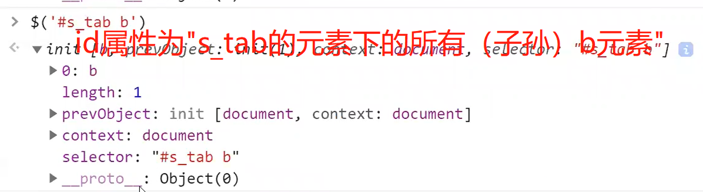
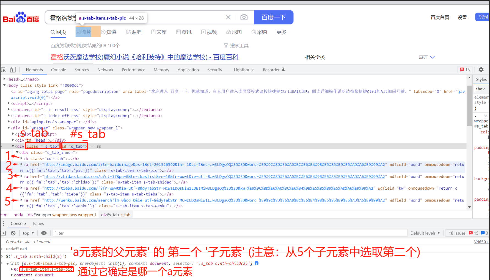
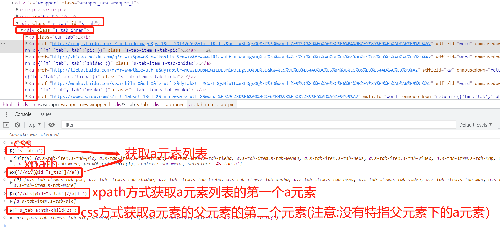
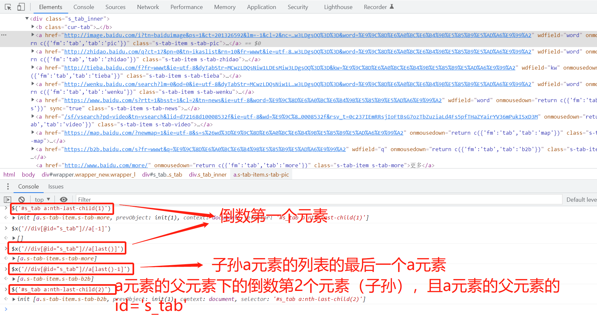