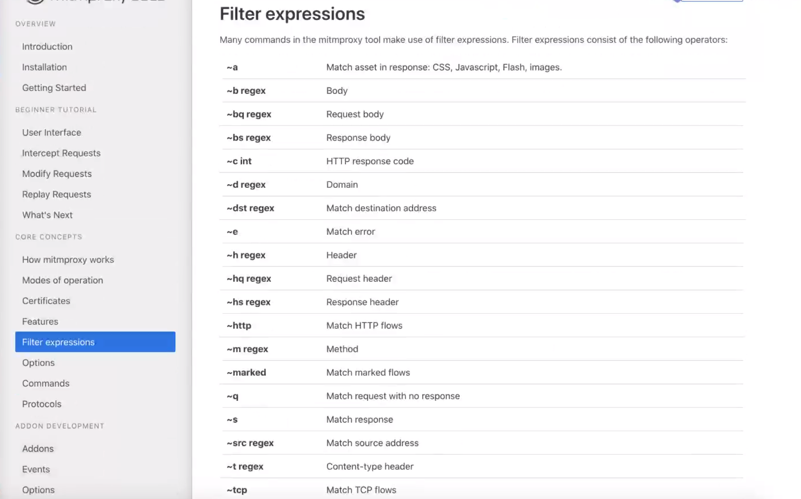

- ##mitmdummp
  - *默认端口 `8080`*
    
- ##修改监听端口 ``-p``

- ##加载python脚本  ``-s py文件``

- ## 录制与回放
  - 录制 ``mitmdump -w tmp`` 
    - ```-w: write```  ```tmp:自定义文件```
    - ``录制并保存到文件tmp中``
  - 过滤 ``mitmdump -nr tmp -w tmp2 "~s hogwarts`` 
    - ``-nr: no 不启动代理，直接从tmp文件read读取即可``
    - ``从tmp文件read读取出来的数据，write写入tmp2``
    - `过滤表达式：~s hogwarts 过滤response中关键词为hogwarts的数据`
      - 
    - `tmp2: 过滤后的文件`
  - 回放 ``mitmdump -nC tmp2``
    - `-n：不启动代理 C：camcorder`
    - ``tmp2: 过滤后的文件``
- ## 