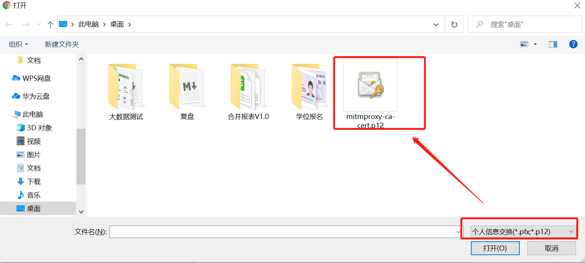

- ##pip install mitmproxy 

   `使用该命令，会自动配置环境变量`
  - mitmdump --version 查看环境表ing是否配置成功
    
- ## 启动
  - 命令 ``指定端口启动mitmdump：  mitmdump -p 8822``
    
- ## 在代理设置成功（PC或移动手机）和启动mitmdump的情况下，浏览器访问mitm.it下载证书

- 
- 
- 
- 
