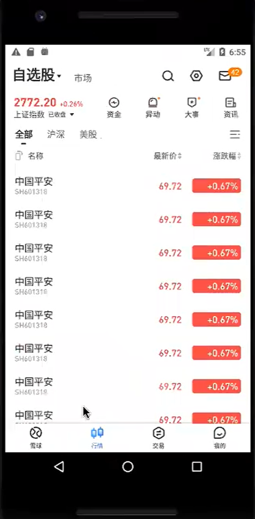

## 1、从原接口响应中获得数据
 - vim /tmp/data_demo.json

## 2、将文件中的数据赋值于变量raw
- raw = $(cat /tmp/data_demo.json)

## 3、运用jq命令做数据翻倍（jq是用来做json处理的【json query】）
- 加倍一次（执行一次该命令 = 加倍一次） 
  
  `$(echo '$raw'| jq '.data.items+=.data.items' | jq '.data.items_size+=.data.items_size')`
- 加倍后的数据重新赋值于变量raw

    `raw = $(echo '$raw'| jq '.data.items+=.data.items' | jq '.data.items_size+=.data.items_size')`

## 4、将数据复制到windows文件夹
    
## 5、charles执行Map Local
- 